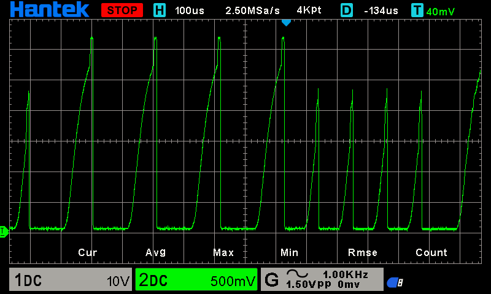
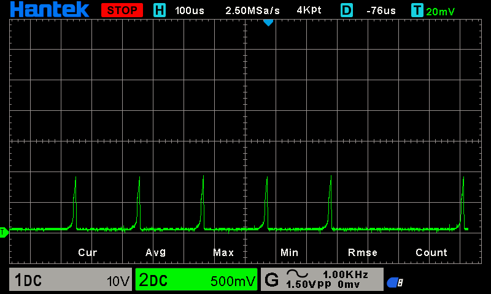
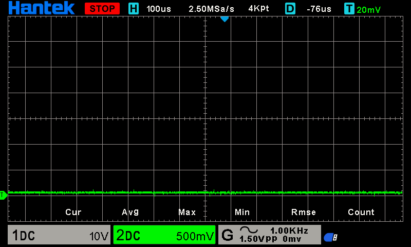

# Beskrivelse af functionen af Sporbesat detektor

## KiCad Sporbesat DesignBlock

## Fritzing Test Board

* Fritzing
  * 
  * 
  * [Stripboard_49x18.fzz](../../../Fritzing/Stripboard_49x18.fzz)

## Diagram beskrivelse

### Testpunkt 3 med forskellige C2 værdier

* C2: 1.0nF
  * 
* C2: 2.2nF
  * 
* C2: 4.7nF
  * 
* C2: 10.0nF
  * 

## Hvordan anbringes sensoren på anlæget

Sensoren på diagrammet er en af fire på samme print, sensor printet anbringes så tæt på skinneafsnittet som muligt, sammen med et transmisions print som sender data til den centrale enhed via *CANBUS Transmitter* er er en meget støjemun dataforbindelse, det som bruges i moderne biler og industrien.

## DCC

### DCC signal

* 
* Vi 2V per division og propen er i x10 så det giver 20V per division.
  * så vi ser her et signal som ca. svinger mellem +20V til -20V
* Vi ser 50µSec. per division 
  * Så vi ser et signal såm svinger melllem 100µSec til 200µSec per periode.
