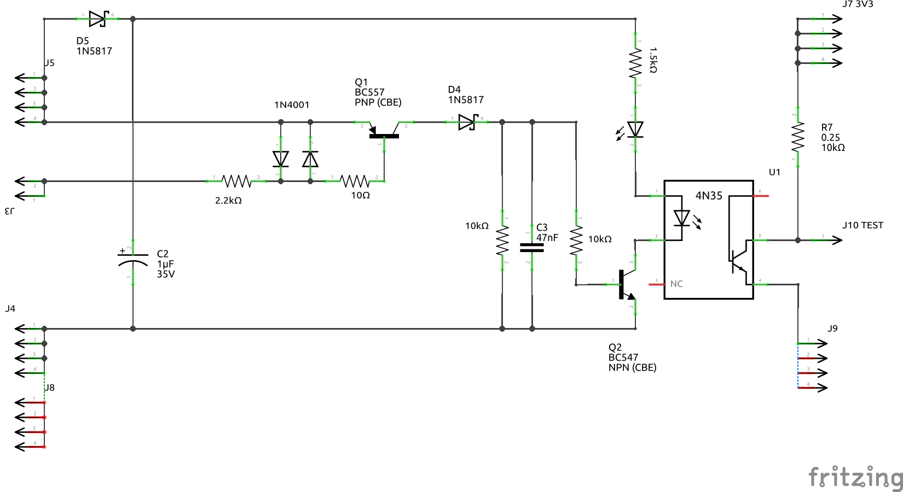
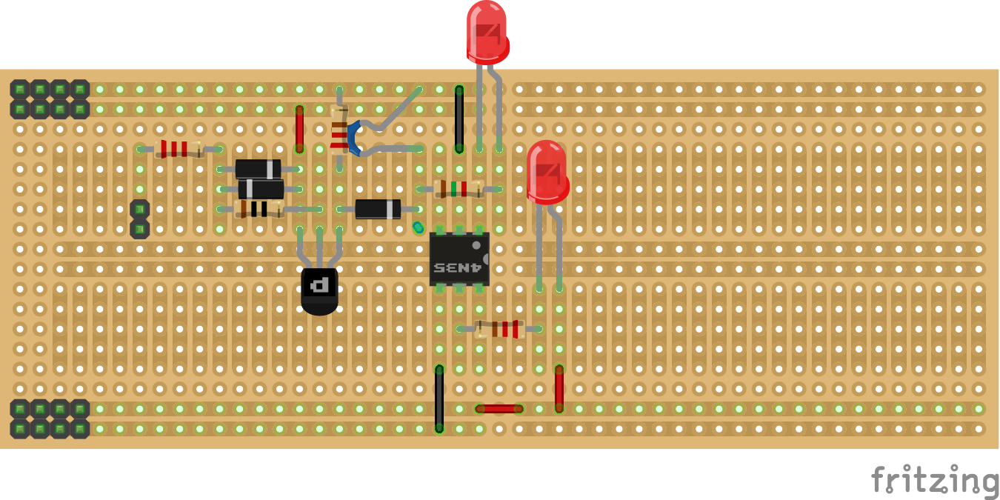
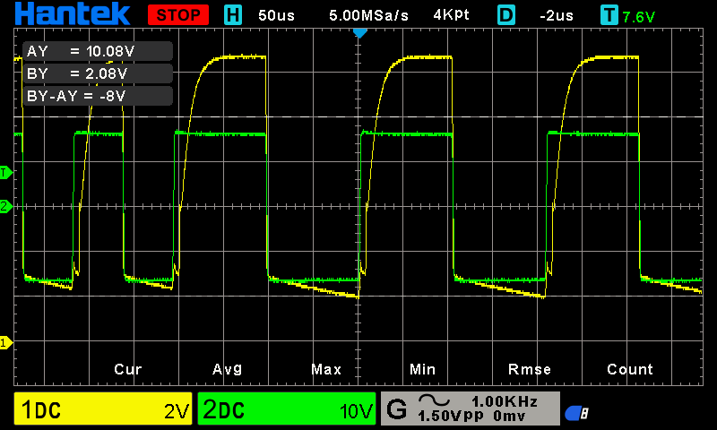
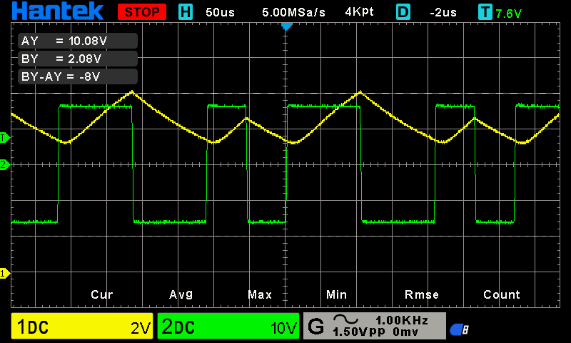
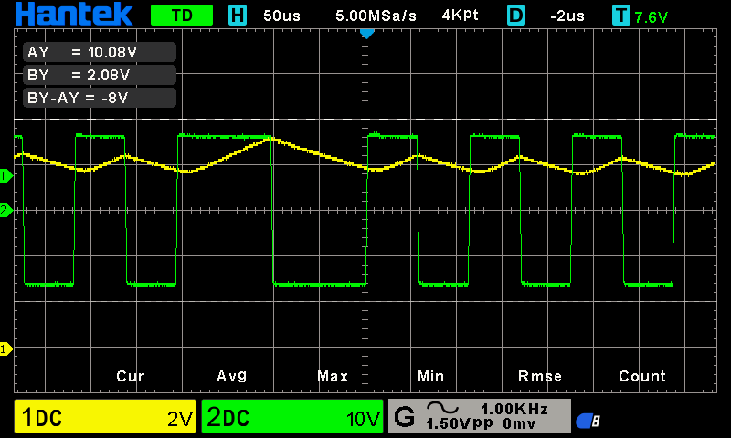
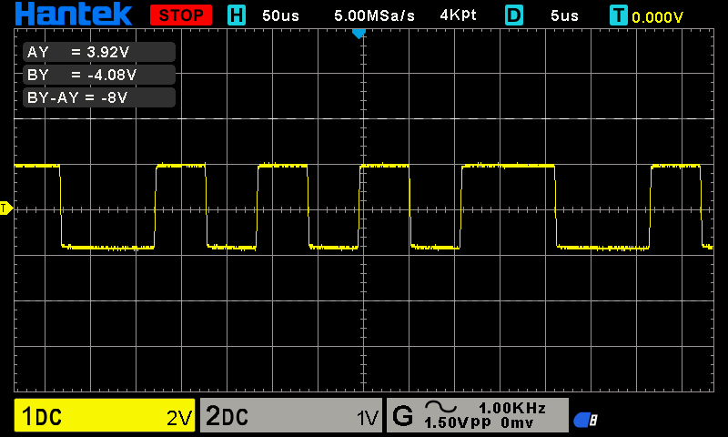
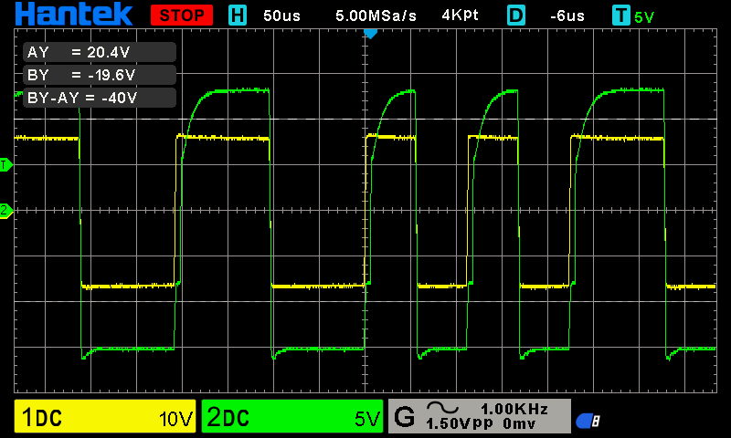
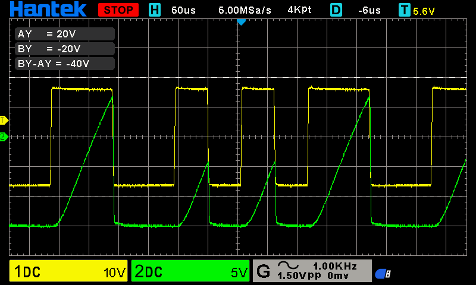

# Beskrivelse af functionen af Sporbesat detektor

## Test Board

* Fritzing
  * 
  * 
  * [Stripboard_49x18.fzz](../../../Fritzing/Stripboard_49x18.fzz)

* Proper
  * Prope 1: Over C1
    * 2V per/div ~ 8V
  * Prope 2: Q1 Emiyyer
    * 10V per/div ~ +-15V
* Kondensator værdier
  * Ingen Kondensator
    * 
  * C = 100nF
    * 
  * C = 200nF
    * 

## Diagram beskrivelse (rettelse kommer)

* **J1:** Skrueterminal hvor DCC Power tilsluttes
* **J2:** Skrueterminal hvor Skinne tilsluttes DCC via sensor
* **D1 & D2:** To 5A Dioder i antiparallel, herigennem leveres hovedparten af strømmen til skinne afsnittet.
* **Q1** Emitter/Basis og R1 bruges til at måle om der vogne på skinnederne:
  * **R1** skal begrænse strømmen i Basis som på ingen måde må over stige 5mA.
  * Er der belastning på skinnederne Leder Q1 Strøm fra Emiter til Collector, i ca 50-100 µSec. det er den tid DCC signalet er Høj, og videre til Optokobleren, som så for NPN Transistoren i optokobleren til at gå Lav (On).
  * Derefter går der ca. 50-100 µSec. med afbrudt forbindelse mellem Emiter og Collector, og derved slukker NPN transistoren i Optokobleren signalet (Off).
  * Denne pulsering vil fortsætte så længe der er vogne på skinnederne, det er ikke helt det vi ønsker, vil gerne have et stabilt signal på udgangen (TP3), der for infører vi en kondensator:
* **CANBUS Transmitter** skal programeres til kun at reagerer på signaler længere end 50 mSec. for at skifte til at vise at afsnittet er besat, på samme måde skal den ikke skifte til at vise afsnittet frit før der manglet signal i mere end 1-2 Sec.
* ***NB!***
  * jeg har ikke helt lagt mig fast på værdierne af R1, R2 & C1, det kommer and på test der vil blive udført på køredage.

## Hvordan anbringes sensoren på anlæget

Sensoren på diagrammet er en af fire på samme print, sensor printet anbringes så tæt på skinneafsnittet som muligt, sammen med et transmisions print som sender data til den centrale enhed via *CANBUS Transmitter* er er en meget støjemun dataforbindelse, det som bruges i moderne biler og industrien.

## DCC

### DCC signal

* 
* Vi 2V per division og propen er i x10 så det giver 20V per division.
  * så vi ser her et signal som ca. svinger mellem +20V til -20V
* Vi ser 50µSec. per division 
  * Så vi ser et signal såm svinger melllem 100µSec til 200µSec per periode.

### ingen tog på skinne

* 

### tog på skinne

* 

### C1 Monteret Tog på skinne: Ikke helt hvad jeg ventede

  * 
  * Kondensatoren C1 mondteret
