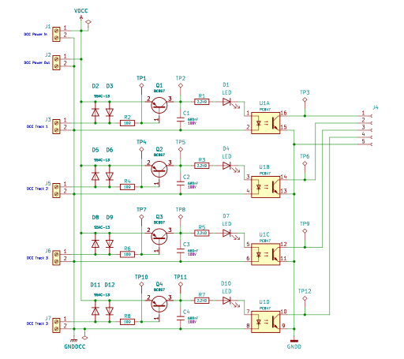

# Sikringsanlæg - Sporbesat

## 4 ports sporbesat detektor kredsløb

* Detektor kredsløb
  * [Beskrivelse af Sporbesat Detektor Diagram](./Detektor/Beskrivelse.md)
  * KiCad (Schmatic & PCB) filer:
    * [Sporbesat-Detektor.kicad_pro](./Detektor/Sporbesat-Detektor/Sporbesat-Detektor.kicad_pro)
    * [Sporbesat-Detektor.kicad_sch](./Detektor/Sporbesat-Detektor/Sporbesat-Detektor.kicad_sch)
    * [Sporbesat-Detektor.kicad_pcb](./Detektor/Sporbesat-Detektor/Sporbesat-Detektor.kicad_pcb)
    * [Sporbesat-Detektor.kicad_prl](./Detektor/Sporbesat-Detektor/Sporbesat-Detektor.kicad_prl)
  * FreeCAD 3D modeller af komponenter:
    * [Datasheet Parts](../../Datasheet/README.md#parts)

## Transmitter

### KiCad (Schmatic & PCB)

* [Track impedans calculater](../../Datasheet/TrackImpedansCalculater.md)

### CanBus

#### KiCad Schmatic & PCB

[esp32-can-bus-shield-v1-0](https://store.mrdiy.ca/p/esp32-can-bus-shield-v1-0/)

* files
* Beskrivelse / forklaring
* [Matriale List](./TransmitterBus/CanBus/Matriale.md)
* ESPHome (Firmware)
  * files
