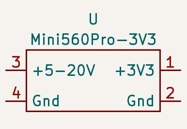
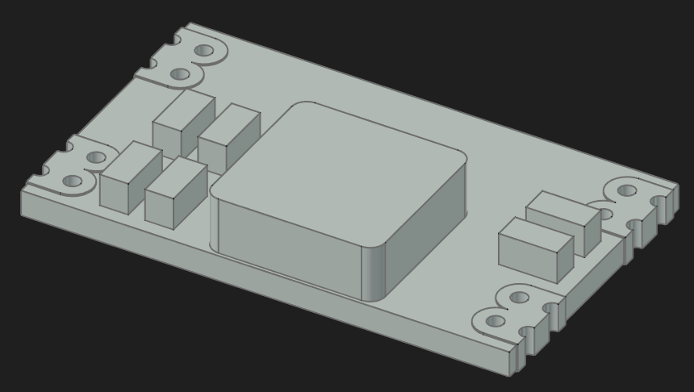
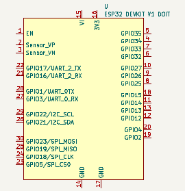
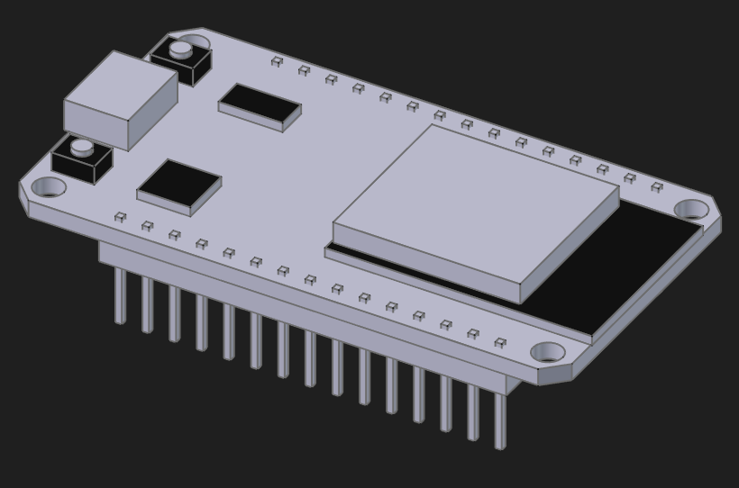
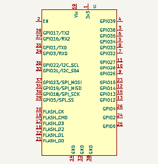
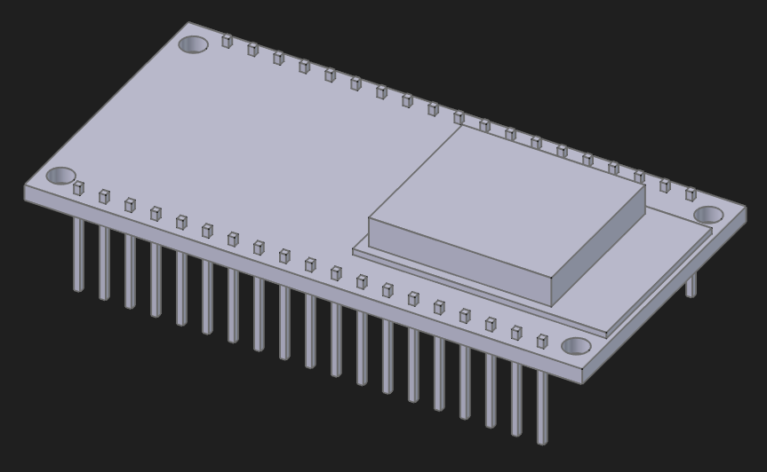
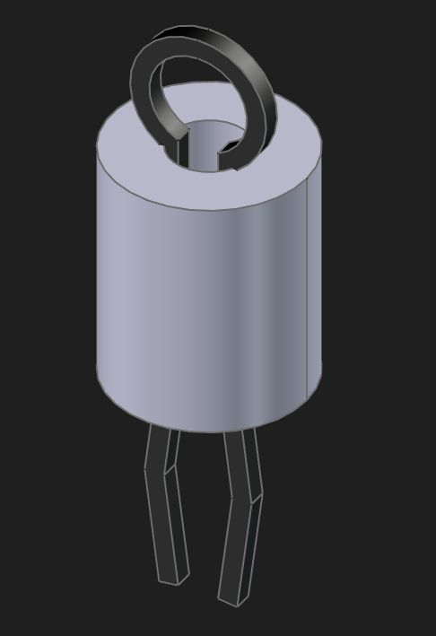
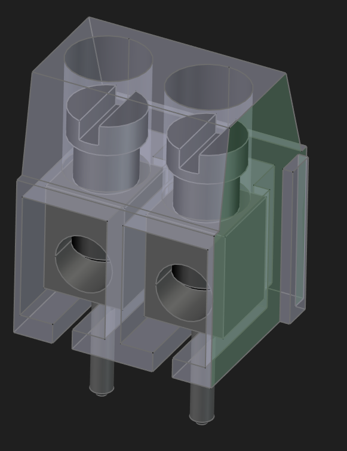
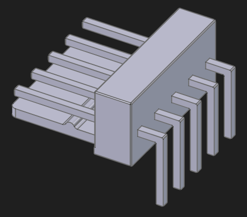

# Libraries

## Semiconductor

|Navn|symbol|footprint|3D|FreeCAD|
|:---:|:---:|:---:|:---:|:---:|

## Modules

|Navn & Datasheet|Kicad symbol|KiCad footprint|FreeCAD 3D|FreeCAD Step|FreeCAD FCStd|
|:---:|:---:|:---:|:---:|:---:|:---:|
|[Mini560Pro](../Datasheet/Modules/Mini560Pro/Mini560Pro.pdf)||||[step](../Datasheet/Modules/Mini560Pro/Mini560Pro-BodyPad003.step)|FCStd|
|[ESP32-DOIT-DEVKIT-V1-Board-Pinout-30-GPIO](../Datasheet/Modules/MCU/ESP32-DOIT-DEVKIT-V1-Board-Pinout-30-GPIO.webp)||||[Step](../Datasheet/Modules/MCU/ESP32-DOIT-DEVKIT-V1-Board-Pinout-30-GPIO.step)
|[ESP-32_38_Pin](../Datasheet/Modules/MCU/ESP-32_38_Pin_diagram_480x480.webp)||||[Step](../Datasheet/Modules/MCU/ESP32_38Pin.step)|

## Stik

|Navn|symbol|footprint|FreeCAD 3D|FreeCAD Step|FreeCAD FCStd|
|:---:|:---:|:---:|:---:|:---:|:---:|
|[PC_Test_Point-Minature](../Datasheet/Stik/TestPoint/5000-5004.PDF)||||[Step](../Datasheet/Stik/TestPoint/PC_Test_Point-Minature.step)|
|Skrueterminal 5,08mm| |||[Step](../Datasheet/Stik/SkrueTerminal/Skrueterminal_508.step)|
|Molex KF2510_5_90 2,54mm||||[Step](../Datasheet/Stik/Molex/KF2510_5_90.step)|
